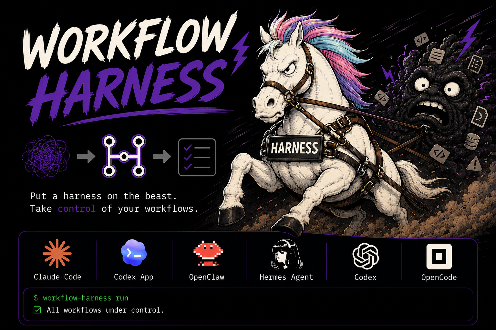

# Workflow Harness - Sistema de Orquestación para Agentes de IA

> Un sistema genérico y projectless para gestionar proyectos mediante múltiples agentes de IA trabajando de forma coordinada.

---

## 📋 Descripción

**Workflow Harness** es un sistema de orquestación diseñado para:
- Coordinar múltiples agentes de IA (7 roles especializados)
- Gestionar tareas de forma estructurada y trazable
- Mantener calidad y consistencia en el desarrollo
- Adaptarse a cualquier tipo de proyecto (e-commerce, SaaS, landing pages, etc.)

### Características Principales
- ✅ **Projectless**: No está atado a ningún proyecto específico
- ✅ **7 Agentes Especializados**: Arquitecto, Code Reviewer, Tester, Frontend, Backend, Ghost, QA Browser
- ✅ **Estructura Clara**: Separación por responsabilidades
- ✅ **Trazabilidad**: Seguimiento de sesiones y progreso
- ✅ **Automatización**: Script de verificación `init.sh`
- ✅ **Genérico**: Se adapta a cualquier stack tecnológico



---

## 🗺️ Estructura del Proyecto

```
workflow-harness/
├── AGENTS.md                 # Punto de entrada (este archivo)
├── init.sh                   # Script de verificación de entorno
├── feature_list.json         # Lista estructurada de tareas
├── 07-BUGS-REPORT.md         # Plantilla de reporte de bugs
├── 08-LOOP.md                # Control de iteraciones
├── TASK-PRINCIPAL.md         # Objetivo global del workflow
├── TESTING-MANUAL.md         # Guía de testing manual
├── .gitignore
├── .workflow-config.json     # Configuración generada automáticamente
├── LICENSE
│
├── agents/                   # Definiciones de roles (7 agentes)
│   ├── 01-arquitecto.md
│   ├── 02-code-reviewer.md
│   ├── 03-tester-debugger.md
│   ├── 04-frontend-ui.md
│   ├── 05-backend.md
│   ├── 06-ghost.md
│   └── 07-qa-browser.md
│
├── tasks/                    # Tareas específicas por agente
│   ├── task-arquitecto.md
│   ├── task-code-reviewer.md
│   ├── task-tester.md
│   ├── task-frontend.md
│   ├── task-backend.md
│   ├── task-ghost.md
│   └── task-qa-browser.md
│
├── skills/                   # Habilidades especializadas
│   ├── skill-pdf.md          # Procesamiento de PDFs
│   ├── skill-ghost-masks.md  # Máscaras para agente Ghost
│   ├── skill-performance.md  # Optimización de rendimiento
│   ├── skill-security.md     # Seguridad
│   ├── skill-ascii.txt       # Arte ASCII
│   ├── skill-qa-automation.md # Automatización QA
│   └── frontend-design/      # Sistemas de diseño (plantillas)
│
├── specs/                    # Contratos funcionales
│   ├── _README.md
│   ├── _template.md
│   └── example/
│
├── docs/                     # Documentación del harness
│   ├── architecture.md       # Estándar de calidad
│   ├── conventions.md        # Convenciones de código
│   └── verification.md       # Criterios de verificación
│
├── progress/                 # Seguimiento de sesiones
│   ├── current.md            # Sesión actual (plantilla)
│   ├── history.md            # Bitácora histórica (append-only)
│   ├── explore_template.md   # Plantilla exploración
│   ├── impl_template.md      # Plantilla implementación
│   └── review_template.md    # Plantilla revisión
│
├── prompts/                  # Templates de prompts
│   └── prompt-template.md
│
├── tests/                    # Tests automáticos del harness
│   ├── test_feature_list.py  # Valida feature_list.json
│   ├── test_structure.py     # Valida estructura del harness
│   └── test_init.sh          # Valida init.sh
│
├── audits/                   # Auditorías de seguridad
│   ├── audit.md              # Plantilla auditoría general
│   └── auditoria.md          # Plantilla auditoría seguridad
│
├── qa/                       # Tests E2E con navegador (Playwright)
│   ├── README.md
│   ├── qa-runner.mjs
│   ├── qa-register.mjs
│   ├── setup-qa-local.sh
│   └── qa-reports/
│
├── user/                     # Documentación para usuarios
│   └── TUTORIAL.md
│
└── assets/                   # Recursos gráficos
    └── harness-workflow.png
```

---

## 🤖️ Los 7 Agentes

| Rol | Archivo | Responsabilidad Principal | LLM Sugerido |
|-----|---------|-------------------------|---------------|
| **ARQUITECTO** | `agents/01-arquitecto.md` | Arquitectura, seguridad, diseño de APIs | big-pickle |
| **CODE REVIEWER** | `agents/02-code-reviewer.md` | Calidad de código, bugs, refactoring | glm-4.7-free |
| **TESTER/DEBUGGER** | `agents/03-tester-debugger.md` | Testing, debugging, documentación | kimi-k2.5-free |
| **FRONTEND/UI** | `agents/04-frontend-ui.md` | UI/UX, componentes, diseño | minimax-m2.1-free |
| **BACKEND** | `agents/05-backend.md` | APIs, lógica, base de datos | big-pickle |
| **GHOST** | `agents/06-ghost.md` | Agente flexible (6 modos) | big-pickle |
| **QA BROWSER** | `agents/07-qa-browser.md` | Testing E2E en navegador real | big-pickle |

### Agente GHOST - Modos Disponibles
- 🕵️ **EXPLORADOR**: Mapear estructura
- 🔧 **QUICK FIX**: Bug fixing rápido
- 📊 **AUDITOR**: Auditorías profundas
- 🎨 **DESIGNER**: Diseño UI/UX
- 🧪 **TESTER**: Validar flujos
- 🔍 **INVESTIGADOR**: Análisis complejo

---

## 📋 Cómo Usar el Workflow

### 1. Inicialización
```bash
bash init.sh
```
El script verifica:
- ✅ Estructura de directorios (agents/, tasks/, skills/, tests/, etc.)
- ✅ Archivos base (AGENTS.md, feature_list.json, etc.)
- ✅ Documentación (docs/)
- ✅ Agentes y tareas definidos
- ✅ Skills disponibles
- ✅ Tests (si Python está disponible)

Genera: `.workflow-config.json` con la configuración.

### 2. Leer Documentación
1. **AGENTS.md** - Punto de entrada obligatorio
2. **feature_list.json** - Ver tareas disponibles
3. **TASK-PRINCIPAL.md** - Objetivo global
4. **tasks/task-[rol].md** - Tarea específica del agente

### 3. Ciclo de Vida de una Sesión
```
1. Ejecutar ./init.sh
   ↓
2. Leer AGENTS.md
   ↓
3. Elegir tarea (feature_list.json - status: "pending")
   ↓
4. Leer task-[rol].md correspondiente
   ↓
5. Analizar codebase y trabajar
   ↓
6. Documentar en progress/current.md
   ↓
7. Ejecutar ./init.sh (verificar)
   ↓
8. Marcar tarea "done" en feature_list.json
   ↓
9. Mover resumen a progress/history.md
   ↓
10. Vaciar progress/current.md
```

---

## 📁 Archivos Clave

### Configuración
| Archivo | Propósito |
|---------|-----------|
| `AGENTS.md` | Punto de entrada y mapa del repositorio |
| `feature_list.json` | Lista de 7 tareas con estados |
| `init.sh` | Verificación automática del entorno |
| `.workflow-config.json` | Configuración generada automáticamente |

### Documentación del Harness
| Archivo | Propósito |
|---------|-----------|
| `docs/architecture.md` | Qué es "hacer un buen trabajo" |
| `docs/conventions.md` | Reglas de estilo y estructura |
| `docs/verification.md` | Cómo verificar que el trabajo funciona |

### Plantillas
| Archivo | Propósito |
|---------|-----------|
| `progress/current.md` | Qué hacer en la sesión actual |
| `progress/history.md` | Bitácora de sesiones anteriores |
| `07-BUGS-REPORT.md` | Plantilla para reportar bugs |
| `08-LOOP.md` | Control de iteraciones (opcional) |

---

## ✅ Estado Actual

### Tareas (feature_list.json)
| ID | Tarea | Status |
|----|-------|--------|
| 1 | init_script | ✅ done |
| 2 | agents_md_entrypoint | ✅ done |
| 3 | clean_project_references | ✅ done |
| 4 | progress_structure | ✅ done |
| 5 | docs_structure | ✅ done |
| 6 | skills_audit | ✅ done |
| 7 | tests_structure | ✅ done |

### Estructura
| Componente | Estado |
|------------|--------|
| Estructura base | ✅ 100% genérico |
| Agentes definidos | ✅ 7/7 genéricos |
| Tareas asignadas | ✅ 7/7 genéricas |
| Documentación | ✅ 3/3 archivos |
| Tests del harness | ✅ 3/3 tests |
| Auditorías | ✅ 2/2 plantillas genéricas |
| Skills | ✅ Limpios y reutilizables |

---

## 🔧 Tecnologías y Dependencias

### Requerimientos
- **Bash** - Para ejecutar `init.sh`
- **Python 3.9+** (opcional) - Para tests automáticos
- **Git** (opcional) - Para control de versiones

### No hay Dependencias de Proyecto
Este harness es **projectless** - no tiene:
- ❌ Código de aplicación
- ❌ Dependencias npm/pip
- ❌ Base de datos
- ❌ Frontend/Backend específico

---

## 📝 Ejemplo de Uso

### Configurar un Nuevo Proyecto (E-commerce)
```bash
# 1. Inicializar
bash init.sh

# Preguntas interactivas:
# - Nombre: "Tienda Online"
# - Tipo: "e-commerce"
# - ¿GitHub?: "y"

# 2. Resultado
# - .workflow-config.json creado
# - .gitignore configurado (excluye /workflow)

# 3. Los agentes trabajan
# - ARQUITECTO: Diseña arquitectura del e-commerce
# - BACKEND: Implementa APIs REST
# - FRONTEND: Crea UI con React/Vue
# - CODE REVIEWER: Valida calidad
# - TESTER: Escribe tests
# - GHOST: Tareas variables
```

---

## 🚀 Comandos Útiles

### Verificación
```bash
bash init.sh              # Verificación completa
bash init.sh | grep "OK"   # Solo exitosos
bash init.sh | grep "WARN" # Solo advertencias
bash init.sh | grep "FAIL" # Solo errores
```

### Tests
```bash
# Tests de Python (si están disponibles)
python3 -m unittest discover -s tests -v

# Tests de Bash
bash tests/test_init.sh
```

---

## 📂 .gitignore Recomendado

```gitignore
# Workflow harness - archivos internos
/workflow
/agents
/tasks
/skills
audits/
user/
*.md
!README.md

# Dependencias
node_modules/
__pycache__/
*.pyc

# Entorno
.env
.DS_Store
```

---

## 🤝 Contribución

1. Fork el repositorio
2. Crea una rama para tu feature (`git checkout -b mi-feature`)
3. Commit tus cambios (`git commit -am 'Agrega mi feature'`)
4. Push a la rama (`git push origin mi-feature`)
5. Abre un Pull Request

### Reglas para Contribuir
- ✅ Mantener el harness **genérico** (sin proyectos específicos)
- ✅ Documentar cambios en `progress/current.md`
- ✅ Ejecutar `./init.sh` antes de hacer commit
- ✅ No dejar archivos temporales ni TODOs sin contexto

---

## 📜 Licencia

MIT License - Ver archivo LICENSE para detalles.

---

## 📞 Soporte

- **Issues**: Reporta bugs en el repositorio de GitHub
- **Tutorial**: Lee `user/TUTORIAL.md` para guía de uso
- **Documentación**: Revisa `docs/` para estándares del harness

---

*Workflow Harness v1.0.0 - Proyecto completamente genérico y projectless*
*Última actualización: Mayo 2026*
