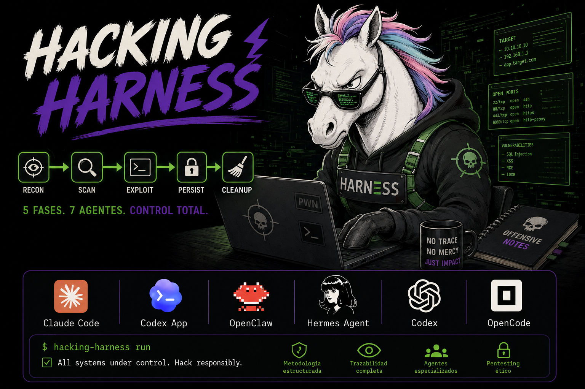

# Hacking Harness - Sistema de Orquestación para Pentesting con IA

> Un sistema genérico y estructurado para realizar auditorías de seguridad y pentesting mediante múltiples agentes de IA trabajando de forma coordinada, siguiendo las 5 fases del hacking ético.

---

## ¿Qué es Harness Engineering?

**Harness Engineering** es la disciplina de diseñar y construir el harness (arnés) que orquesta, coordina y automatiza flujos de trabajo complejos de seguridad. En lugar de ejecutar herramientas de forma aislada, un harness engineering define:

- **Puntos de integración** para conectar herramientas dispares (nmap, Burp Suite, Metasploit, scripts propios)
- **Flujos estructurados** que guían al operador o agente IA paso a paso por las fases del pentesting
- **Gestión de estado y trazabilidad** para saber qué se hizo, cuándo y con qué resultado
- **Mecanismos de verificación** que aseguran la integridad del proceso antes de avanzar

Este repositorio es un **Harness de Pentesting**: un sistema que envuelve las herramientas y metodologías en una capa de orquestación para que agentes de IA puedan ejecutar auditorías de seguridad de forma estructurada, reproducible y trazable.

---

## Descripción

**Hacking Harness** es un sistema de orquestación diseñado para:
- Coordinar múltiples agentes de IA (7 roles especializados por fase de hacking)
- Gestionar auditorías de seguridad de forma estructurada y trazable
- Mantener metodología y buenas prácticas de pentesting
- Adaptarse a cualquier tipo de objetivo (web, red, móvil, API)

### Características Principales
- **Metodología Estructurada**: 5 fases de pentesting (Recon → Scan → Exploit → Persist → Cleanup)
- **7 Agentes Especializados**: Recon, Scan, Exploit, Persist, Cleanup, Ghost, QA Browser
- **Estructura Clara**: Separación por fases y responsabilidades
- **Trazabilidad**: Seguimiento de sesiones y hallazgos
- **Automatización**: Script de verificación `init.sh`
- **Genérico**: Se adapta a cualquier objetivo o infraestructura



---

## Las 5 Fases del Pentesting

```
FASE 1: RECONOCIMIENTO
   └─> OSINT, footprinting, recolección pasiva/activa de información
   
FASE 2: ESCANEO Y ENUMERACIÓN
   └─> Puertos, servicios, vulnerabilidades, fingerprinting

FASE 3: OBTENCIÓN DE ACCESO
   └─> Explotación de vulnerabilidades, SQLi, XSS, RCE

FASE 4: MANTENIMIENTO DE ACCESO
   └─> Persistencia, backdoors, movimiento lateral

FASE 5: BORRADO DE HUELLAS
   └─> Limpieza de logs, manipulación forense, informe
```

---

## Los 7 Agentes

| Rol | Archivo | Responsabilidad Principal | Fase |
|-----|---------|---------------------------|------|
| **RECON-AGENT** | `agents/01-recon-agent.md` | Footprinting, OSINT, recolección de información | 1. Recon |
| **SCAN-AGENT** | `agents/02-scan-agent.md` | Escaneo, enumeración, detección de vulns | 2. Scan |
| **EXPLOIT-AGENT** | `agents/03-exploit-agent.md` | Explotación y obtención de acceso | 3. Exploit |
| **PERSIST-AGENT** | `agents/04-persist-agent.md` | Persistencia y movimiento lateral | 4. Persist |
| **CLEANUP-AGENT** | `agents/05-cleanup-agent.md` | Limpieza de huellas e informe | 5. Cleanup |
| **GHOST** | `agents/06-ghost.md` | Agente flexible multi-fase | Variable |
| **QA-BROWSER** | `agents/07-qa-browser.md` | Validación en navegador real | Transversal |

---

## Cómo Usar el Workflow

### 1. Inicialización
```bash
bash init.sh
```
El script verifica:
- Estructura de directorios (agents/, tasks/, skills/, tests/)
- Archivos base (AGENTS.md, feature_list.json)
- Herramientas de hacking disponibles (nmap, curl, python3, etc.)
- Tests del harness

Genera: `.workflow-config.json` con la configuración.

### 2. Flujo de Trabajo
```
1. Ejecutar init.sh → verificar entorno
2. Leer AGENTS.md → entender el sistema
3. Elegir fase y agente en feature_list.json
4. Leer task-[rol].md → tarea específica
5. Analizar objetivo y trabajar
6. Documentar en progress/current.md
7. Ejecutar init.sh → verificar
8. Marcar tarea "done" en feature_list.json
```

### 3. Ciclo de Vida de una Auditoría
```
FASE 1 ──> FASE 2 ──> FASE 3 ──> FASE 4 ──> FASE 5
  RECON      SCAN      EXPLOIT    PERSIST    CLEANUP
   │          │          │          │          │
   └──────────┴──────────┴──────────┴──────────┘
                       │
                 QA-BROWSER (validación transversal)
                       │
                  GHOST (soporte multi-fase)
```

---

## Archivos Clave

### Configuración
| Archivo | Propósito |
|---------|-----------|
| `AGENTS.md` | Punto de entrada y mapa del repositorio |
| `feature_list.json` | Lista de tareas con estados |
| `init.sh` | Verificación automática del entorno |
| `.workflow-config.json` | Configuración generada automáticamente |

### Documentación del Harness
| Archivo | Propósito |
|---------|-----------|
| `docs/methodology.md` | Metodología de pentesting (5 fases) |
| `docs/conventions.md` | Reglas de estilo y estructura |
| `docs/verification.md` | Cómo verificar hallazgos de seguridad |

### Plantillas
| Archivo | Propósito |
|---------|-----------|
| `progress/current.md` | Qué hacer en la sesión actual |
| `progress/history.md` | Bitácora de sesiones anteriores |
| `07-BUGS-REPORT.md` | Plantilla para reportar vulnerabilidades |
| `08-LOOP.md` | Control de iteraciones (opcional) |

---

## Estado Actual

### Tareas (feature_list.json)
| ID | Tarea | Status |
|----|-------|--------|
| 1 | init_script | done |
| 2 | agents_md_entrypoint | done |
| 3 | agents_roles | done |
| 4 | tasks_by_phase | done |
| 5 | docs_system | done |
| 6 | skills_library | in_progress |
| 7 | tests_structure | done |
| 8 | qa_security_tests | done |
| 9 | prompt_system | done |
| 10 | bug_report_vulnerability | done |
| 11 | readme_hacking_harness | done |

---

## Tecnologías y Dependencias

### Requerimientos del Harness
- **Bash** - Para ejecutar `init.sh`
- **Python 3.9+** (opcional) - Para tests automáticos
- **Git** (opcional) - Para control de versiones

### Herramientas de Hacking (detectadas por init.sh)
- **nmap** - Escaneo de puertos y servicios
- **curl** - Peticiones HTTP y APIs
- **gobuster/dirsearch** - Enumeración web
- **Metasploit** (opcional) - Framework de explotación
- **sqlmap** (opcional) - SQL Injection automation
- **Burp Suite** (opcional) - Proxy de interceptación

---

*Hacking Harness v1.0.0 - Metodología de Pentesting Estructurada*
*Adaptado de Workflow Harness para auditorías de seguridad*
*Última actualización: Junio 2026*
